# Borneo Indobara - Truck Tracking & Fleet Management System

A comprehensive web-based fleet management and real-time truck tracking system for PT Borneo Indobara. This application provides live vehicle tracking, tire pressure monitoring (TPMS), fuel monitoring, temperature monitoring, and complete fleet management capabilities.

## Deskripsi Proyek

Borneo Indobara Truck Tracking System adalah platform manajemen armada yang dirancang khusus untuk industri pertambangan dan transportasi. Sistem ini menyediakan:

- **Real-time Tracking**: Pelacakan posisi kendaraan secara langsung menggunakan GPS
- **TPMS Integration**: Monitoring tekanan ban dan suhu ban secara real-time
- **Fleet Management**: Manajemen lengkap data kendaraan, driver, sensor, dan perangkat IoT
- **Historical Tracking**: Riwayat perjalanan kendaraan dengan replay tracking
- **Monitoring Dashboard**: Dashboard interaktif dengan visualisasi data dan statistik
- **Alert System**: Sistem notifikasi untuk anomali dan peringatan kendaraan
- **Multi-vendor Support**: Dukungan untuk multiple vendor dan grup armada

## Use Case Diagram

Diagram berikut menunjukkan interaksi admin dengan sistem:


### Fungsi Utama yang Dapat Dilakukan Admin:

1. **Login & Autentikasi** - Masuk ke sistem dengan kredensial yang aman
2. **Dashboard TPMS** - Melihat ringkasan kondisi tekanan ban seluruh armada
3. **Tracking Kendaraan** - Memantau lokasi dan rute kendaraan secara real-time
4. **Riwayat Perjalanan** - Melihat histori perjalanan kendaraan dengan detail lengkap
5. **Monitoring Kondisi** - Memantau kondisi kendaraan dan suhu secara berkala
6. **Manajemen Data** - Mengelola data kendaraan, driver, vendor, device IoT, dan sensor
7. **Import/Export Data** - Mengimpor dan mengekspor data dalam format CSV
8. **Notifikasi Alert** - Menerima dan mengelola peringatan sistem
9. **Pengaturan Akun** - Mengatur profil dan preferensi pengguna
10. **Logout** - Keluar dari sistem dengan aman

## Fitur Utama

### 1. 🏠 Dashboard

Dashboard utama yang menampilkan ringkasan kondisi armada secara keseluruhan.

- **Statistik Armada**: Total kendaraan, kendaraan aktif, idle, dan offline
- **Charts & Grafik**: Visualisasi data dalam bentuk pie chart, area chart, line chart
- **Status Overview**: Ringkasan status armada dan alert terbaru
- **Quick Access**: Akses cepat ke fitur-fitur utama

### 2. 🗺️ Tracking

#### Live Tracking
Memantau posisi dan aktivitas kendaraan secara real-time di peta interaktif.

- **Peta Interaktif**: Tampilan peta dengan marker untuk setiap kendaraan
- **Status Real-time**: Menampilkan status kendaraan (Aktif, Idle, atau Nonaktif)
- **Informasi Detail**: Lihat driver, kecepatan, arah, dan lokasi kendaraan
- **Auto Update**: Data posisi diperbarui otomatis setiap beberapa detik
- **Filter Kendaraan**: Saring tampilan berdasarkan status atau vendor

#### History Tracking
Menampilkan rekaman perjalanan kendaraan dengan fitur playback.

- **Pilih Periode**: Filter berdasarkan tanggal dan waktu tertentu
- **Replay Perjalanan**: Putar ulang rute perjalanan di peta
- **Detail Tracking**: Lihat kecepatan, waktu, dan posisi setiap titik
- **Export Data**: Unduh data riwayat dalam format CSV
- **Analisis Rute**: Identifikasi pola perjalanan kendaraan

### 3. 📊 Monitoring

#### Sensors (Tire & Temperature)
Monitoring kondisi ban dan suhu kendaraan untuk mencegah kecelakaan dan kerusakan.

- **Tire Pressure Monitoring**: Monitor tekanan dan suhu 10 ban per kendaraan
- **Temperature Monitoring**: Monitor suhu engine dan sistem kendaraan
- **Alert Otomatis**: Notifikasi jika tekanan ban atau suhu abnormal
- **Visual Display**: Tampilan grafis yang mudah dipahami
- **Histori Data**: Lihat tren perubahan tekanan dan suhu

### 4. 🚛 Fleet Management

#### All Vehicles (Trucks)
Kelola informasi lengkap armada kendaraan perusahaan.

- **Data Lengkap**: Nomor polisi, model, tahun, foto kendaraan
- **Assign Driver**: Tetapkan driver ke kendaraan tertentu
- **Assign Sensor**: Hubungkan sensor TPMS dengan kendaraan
- **Status Kendaraan**: Aktif, maintenance, atau nonaktif
- **Vendor Assignment**: Kelompokkan kendaraan berdasarkan vendor
- **Import/Export**: Upload data dari CSV atau download data

#### Drivers
Kelola informasi pengemudi dan lisensi mereka.

- **Profil Driver**: Nama, foto, nomor lisensi, kontak
- **Lisensi**: Jenis SIM, tanggal kadaluarsa
- **Riwayat Tugas**: History penugasan driver ke kendaraan
- **Status Ketersediaan**: Aktif, cuti, atau nonaktif
- **Pencarian**: Cari driver berdasarkan nama atau nomor lisensi

#### Vendors
Kelola informasi vendor penyedia kendaraan.

- **Data Vendor**: Nama, kode, alamat, kontak
- **Daftar Kendaraan**: Lihat semua kendaraan dari vendor tertentu
- **Performa Vendor**: Track kinerja vendor
- **Status Kontrak**: Aktif atau tidak aktif

### 5. 🔌 IoT Devices

#### Device Center
Kelola perangkat GPS dan IoT yang terpasang di kendaraan.

- **Device Management**: IMEI, nomor SIM card, firmware version
- **Status Koneksi**: Monitor konektivitas real-time
- **Assignment**: Hubungkan device dengan kendaraan
- **Configuration**: Setup dan konfigurasi perangkat

#### Sensor Management
Kelola sensor TPMS yang terpasang di ban kendaraan.

- **Sensor TPMS**: ID sensor, posisi ban (FR, FL, RR1-4, RL1-4)
- **Status Battery**: Monitor daya battery sensor
- **Kalibrasi**: Setup dan kalibrasi sensor
- **Assignment**: Hubungkan sensor dengan kendaraan tertentu

### 6. 📦 Master Data

Hub untuk mengelola semua data master dalam satu halaman.

- **Quick Access**: Akses cepat ke semua modul master data
- **Overview**: Statistik jumlah data per kategori
- **Bulk Operations**: Operasi massal untuk import/export data
- **Navigation**: Navigasi mudah ke form tambah/edit data

### 7. 🔔 Alerts

Sistem notifikasi dan peringatan untuk kondisi abnormal.

- **Alert List**: Daftar semua alert dengan filter
- **Alert Types**: Tekanan ban, suhu, device offline, overspeed
- **Alert Severity**: Critical, Warning, Info
- **Acknowledge**: Tandai alert yang sudah ditangani
- **History**: Riwayat semua alert yang pernah terjadi
- **Filter**: Berdasarkan kendaraan, tipe, severity, tanggal

### 8. ⚙️ Settings

Pengaturan aplikasi dan profil pengguna.

- **User Profile**: Kelola informasi profil pengguna
- **Preferences**: Atur preferensi tampilan dan notifikasi
- **Account Settings**: Ganti password dan pengaturan akun
- **System Config**: Konfigurasi sistem (untuk admin)

## Teknologi yang Digunakan

### Frontend

- **React 19** - UI Library
- **React Router v7** - Navigation
- **Vite 7** - Build tool & dev server
- **Tailwind CSS v4** - Styling framework

### Maps & Tracking

- **Leaflet** - Interactive maps
- **React Leaflet** - React bindings for Leaflet
- **Leaflet Polyline Decorator** - Route decorations

### Developer Tools

- **ESLint** - Code linting
- **Prettier** - Code formatting
- **SWC** - Fast refresh

## Instalasi

### Prasyarat

Pastikan Anda telah menginstal:

- **Node.js** versi 22.18.0
- **npm** atau **yarn**
- **Git**

### Langkah Instalasi

1. **Clone repository**

   ```bash
   git clone https://github.com/JosinBahaswan/Truck-Tracking.git
   cd borneo-indobara
   ```

2. **Install dependencies**

   ```bash
   npm install
   ```

   atau

   ```bash
   yarn install
   ```

3. **Konfigurasi Environment**

   Copy file `.env.example` menjadi `.env`:

   ```bash
   cp .env.example .env
   ```

   Edit file `.env` dan sesuaikan dengan URL backend Anda:

   ```env
   # Backend 2 - Management & Master Data
   VITE_API_BASE_URL=https://your-backend-server.com/api
   VITE_WS_URL=wss://your-backend-server.com/ws

   # Backend 1 - Tracking & TPMS
   VITE_TRACKING_API_BASE_URL=https://your-tracking-server.com
   VITE_TRACKING_WS_URL=wss://your-tracking-server.com/ws
   ```

4. **Jalankan Development Server**

   ```bash
   npm run dev
   ```

   Aplikasi akan berjalan di `http://localhost:5173`

5. **Build untuk Production**

   ```bash
   npm run build
   ```

   File build akan tersimpan di folder `dist/`

6. **Preview Production Build**
   ```bash
   npm run preview
   ```

## 📁 Struktur Proyek

```
borneo-indobara/
├── 📄 index.html                    # File HTML utama aplikasi
├── 📄 package.json                  # Daftar dependencies dan scripts
├── 📄 vite.config.js                # Konfigurasi Vite build tool
├── 📄 tailwind.config.js            # Konfigurasi Tailwind CSS
├── 📄 eslint.config.js              # Aturan code linting ESLint
├── 📄 .env                          # Environment variables (tidak di-commit)
├── 📄 .env.example                  # Template untuk environment variables
├── 📄 README.md                     # Dokumentasi utama proyek (file ini)
├── 📄 documentation.md              # Dokumentasi teknis detail
├── 📄 route1.md                     # Dokumentasi route 1
├── 📄 route2.md                     # Dokumentasi route 2
│
├── 📁 public/                       # File statis yang tidak diproses
│   └── images/                      # Gambar logo, icon, dll
│
├── 📁 screenshots/                  # Screenshot untuk dokumentasi
│   ├── usecase.png                  # Gambar use case diagram
│   ├── livetracking.png             # Gambar halaman live tracking
│   ├── history.png                  # Gambar halaman history
│   ├── dashboard.png                # Gambar dashboard
│   └── ...                          # Screenshot lainnya
│
├── 📁 data/                         # File contoh untuk import data
│   ├── import-test-trucks.csv       # Contoh format import kendaraan
│   ├── import-test-drivers.csv      # Contoh format import driver
│   ├── import-test-sensors.csv      # Contoh format import sensor
│   ├── import-test-devices.csv      # Contoh format import device
│   ├── import-test-vendors.csv      # Contoh format import vendor
│   ├── import-trucks-from-44.csv    # Data import truck dari sistem 44
│   ├── test-user-import.csv         # Contoh format import user
│   └── test-user-update.csv         # Contoh format update user
│
└── 📁 src/                          # Folder source code utama
    ├── 📄 main.jsx                  # Entry point aplikasi React
    ├── 📄 App.jsx                   # Komponen utama aplikasi
    ├── 📄 App.css                   # Style khusus untuk App
    ├── 📄 index.css                 # Style global aplikasi
    │
    ├── 📁 components/               # Komponen UI yang reusable
    │   │
    │   ├── 📁 auth/                 # Komponen untuk autentikasi
    │   │   └── Login.jsx            # Form login pengguna
    │   │
    │   ├── 📁 common/               # Komponen umum yang sering dipakai
    │   │   ├── Button.jsx           # Komponen tombol custom
    │   │   ├── DatePicker.jsx       # Komponen pilih tanggal
    │   │   ├── DropdownMenu.jsx     # Komponen menu dropdown
    │   │   ├── AlertModal.jsx       # Modal untuk menampilkan alert
    │   │   ├── DuplicateModal.jsx   # Modal konfirmasi duplikasi
    │   │   ├── ErrorBoundary.jsx    # Penanganan error React
    │   │   ├── TruckImage.jsx       # Komponen tampilan gambar truk
    │   │   └── CommandPalette.jsx   # Quick search (Ctrl+K)
    │   │
    │   ├── 📁 chart/                # Komponen untuk grafik/chart
    │   │   ├── AlertTrendsChart.jsx # Chart tren alert
    │   │   ├── FleetStatusChart.jsx # Chart status armada
    │   │   ├── VehicleActivityChart.jsx  # Chart aktivitas kendaraan
    │   │   ├── TemperatureChart.jsx # Chart suhu kendaraan
    │   │   ├── TirePressureChart.jsx # Chart tekanan ban
    │   │   ├── PieChartDonut.jsx    # Chart pie berbentuk donut
    │   │   ├── PieChartLabel.jsx    # Chart pie dengan label
    │   │   └── AreaChartGradient.jsx # Chart area dengan gradient
    │   │
    │   ├── 📁 dashboard/            # Komponen khusus dashboard
    │   │   ├── TailwindFleetOverview.jsx  # Overview armada
    │   │   ├── TailwindStatCard.jsx # Card statistik
    │   │   ├── SimpleChartCard.jsx  # Card dengan chart sederhana
    │   │   └── TirePressureDisplay.jsx # Display visual tekanan ban
    │   │
    │   ├── 📁 layout/               # Komponen tata letak aplikasi
    │   │   ├── TailwindHeader.jsx   # Header/Navbar atas
    │   │   ├── TailwindSidebar.jsx  # Sidebar menu samping
    │   │   └── TailwindLayout.jsx   # Layout wrapper utama
    │   │
    │   └── 📁 icons/                # Icon custom buatan sendiri
    │       └── WheelFrontIcon.jsx   # Icon roda depan kendaraan
    │
    ├── 📁 pages/                    # Halaman-halaman aplikasi
    │   ├── Dashboard.jsx            # Halaman dashboard utama
    │   ├── LiveTracking.jsx         # Halaman tracking real-time
    │   ├── HistoryTracking.jsx      # Halaman riwayat perjalanan
    │   ├── MasterData.jsx           # Halaman hub master data
    │   ├── Reports.jsx              # Halaman laporan
    │   ├── Settings.jsx             # Halaman pengaturan
    │   ├── ComingSoon.jsx           # Halaman placeholder fitur baru
    │   │
    │   ├── 📁 form/                 # Halaman form tambah/edit data
    │   │   ├── TruckForm.jsx        # Form tambah/edit kendaraan
    │   │   ├── DriverForm.jsx       # Form tambah/edit driver
    │   │   ├── SensorForm.jsx       # Form tambah/edit sensor TPMS
    │   │   ├── DeviceForm.jsx       # Form tambah/edit device IoT
    │   │   └── VendorForm.jsx       # Form tambah/edit vendor
    │   │
    │   ├── 📁 listdata/             # Halaman daftar/tabel data
    │   │   ├── TrucksList.jsx       # Tabel daftar kendaraan
    │   │   ├── DriversList.jsx      # Tabel daftar driver
    │   │   ├── Sensors.jsx          # Tabel daftar sensor
    │   │   ├── Devices.jsx          # Tabel daftar device IoT
    │   │   ├── VendorsList.jsx      # Tabel daftar vendor
    │   │   └── Alerts.jsx           # Tabel daftar alert/notifikasi
    │   │
    │   ├── 📁 monitoring/           # Halaman monitoring kondisi
    │   │   └── SensorMonitoring.jsx # Monitor status sensor
    │   │
    │   └── 📁 tracking/             # Komponen tambahan tracking
    │
    ├── 📁 services/                 # Layer komunikasi dengan backend
    │   ├── 📄 index.js              # Export semua service
    │   ├── 📄 alertEvents.api.js    # API untuk event alert
    │   │
    │   ├── 📁 management/           # Service Backend 2 (Management)
    │   │   ├── 📄 config.js         # Konfigurasi API & WebSocket
    │   │   ├── 📄 index.js          # Export management services
    │   │   ├── 📄 websocket.js      # Konfigurasi WebSocket
    │   │   │
    │   │   ├── 📁 base/             # Utilitas dasar API
    │   │   │   └── api.js           # Axios instance dengan interceptor
    │   │   │
    │   │   └── 📁 modules/          # Modul API terorganisir
    │   │       ├── 📁 auth/         # API login, logout, profil
    │   │       ├── 📁 fleet/        # API kendaraan, driver, vendor
    │   │       ├── 📁 iot/          # API device IoT & sensor
    │   │       ├── 📁 monitoring/   # API monitoring & alert
    │   │       └── 📁 operations/   # API operasional & laporan
    │   │
    │   ├── 📁 tracking/             # Service Backend 1 (Tracking)
    │   │   ├── 📄 config.js         # Konfigurasi tracking API
    │   │   ├── 📄 index.js          # Export tracking services
    │   │   ├── 📄 tracking.api.js   # API live tracking GPS
    │   │   ├── 📄 history.api.js    # API riwayat perjalanan
    │   │   ├── 📄 tpms.api.js       # API data TPMS
    │   │   └── 📄 monitoring.api.js # API monitoring tracking
    │   │
    │   └── 📁 websocket/            # Service WebSocket real-time
    │
    ├── 📁 hooks/                    # Custom React hooks
    │   ├── useAuth.js               # Hook untuk autentikasi
    │   ├── useApi2.js               # Hook untuk panggil API
    │   ├── useAlert.js              # Hook untuk manajemen alert
    │   └── useAlertNotifications.js # Hook untuk notifikasi real-time
    │
    └── 📁 routes/                   # Konfigurasi routing aplikasi
        ├── index.jsx                # Definisi semua route
        ├── ProtectedRoute.jsx       # Guard untuk route yang perlu login
        └── PublicRoute.jsx          # Route yang bisa diakses tanpa login
```

### Penjelasan Struktur:

- **`/src/components`**: Komponen UI yang dapat digunakan kembali
- **`/src/pages`**: Halaman-halaman utama aplikasi
- **`/src/services`**: Layer komunikasi dengan backend API
- **`/src/hooks`**: Custom hooks untuk logic yang reusable
- **`/src/routes`**: Konfigurasi routing dan protected routes
- **`/data`**: Template CSV untuk import data
- **`/screenshots`**: Screenshot untuk dokumentasi

## 📸 Screenshots

### 1. Dashboard

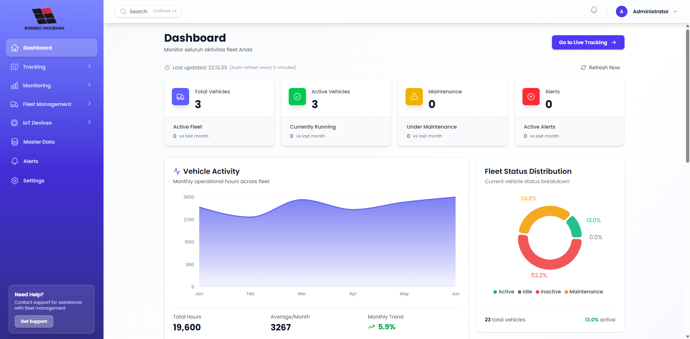
*Dashboard utama dengan statistik armada, charts, dan overview*

### 2. Live Tracking

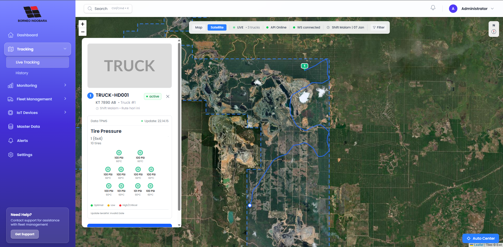
*Peta real-time tracking kendaraan dengan marker dan status monitoring*

### 3. History Tracking

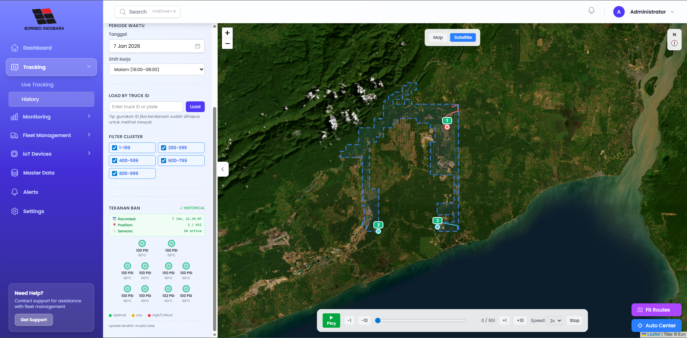
*Riwayat perjalanan kendaraan dengan playback control dan data tracking lengkap*

---

## Monitoring Pages

### 4. Temperature and Pressure Monitoring


---

## Fleet Management - List Data

### 5. Vehicles List

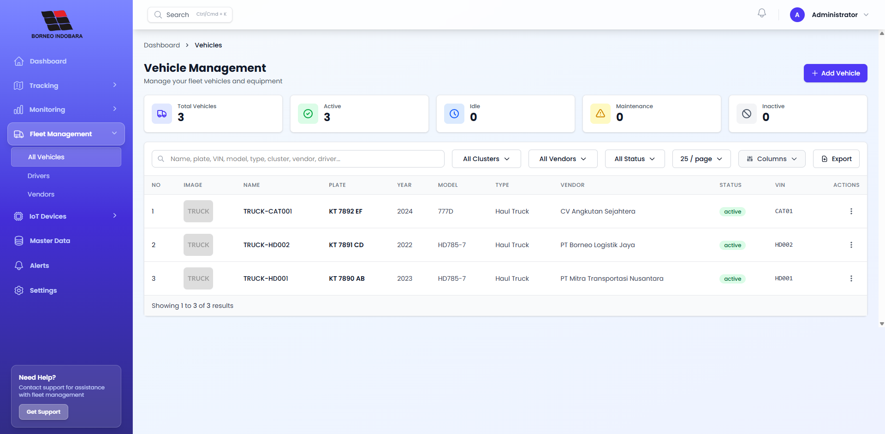
_Daftar kendaraan dengan informasi lengkap dan fitur search/filter_

### 6. Drivers List

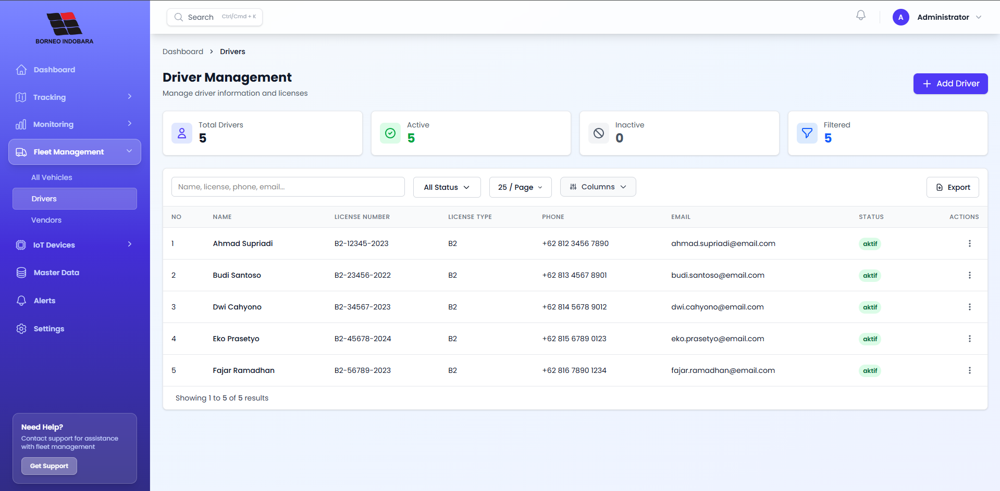
_Daftar pengemudi dengan data lisensi dan status_

### 7. Sensors List

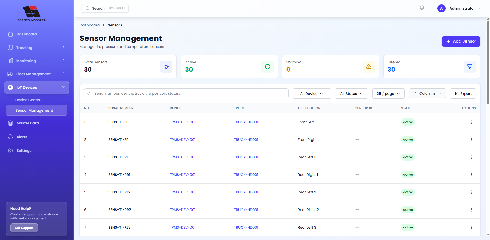
_Daftar sensor TPMS yang terpasang pada kendaraan_

### 8. Devices List

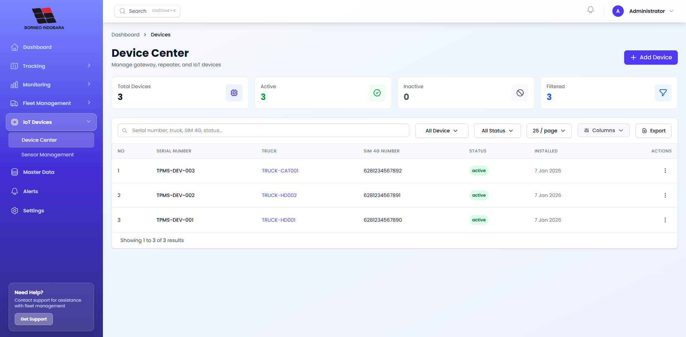
_Daftar perangkat IoT dan GPS tracker_

### 9. Vendors List

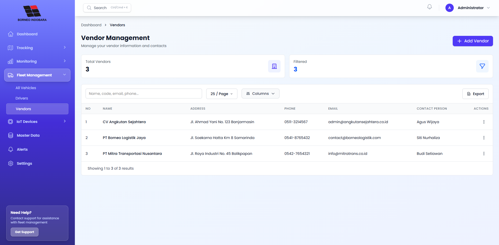
_Daftar vendor dan kontraktor yang bekerja sama_

### 10. Alerts List

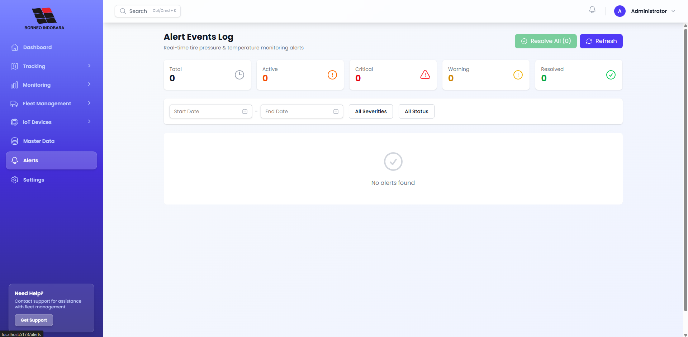
_Daftar notifikasi dan peringatan sistem dengan filter_

---

## Forms - Create/Edit Data

### 11. Add New Vehicle

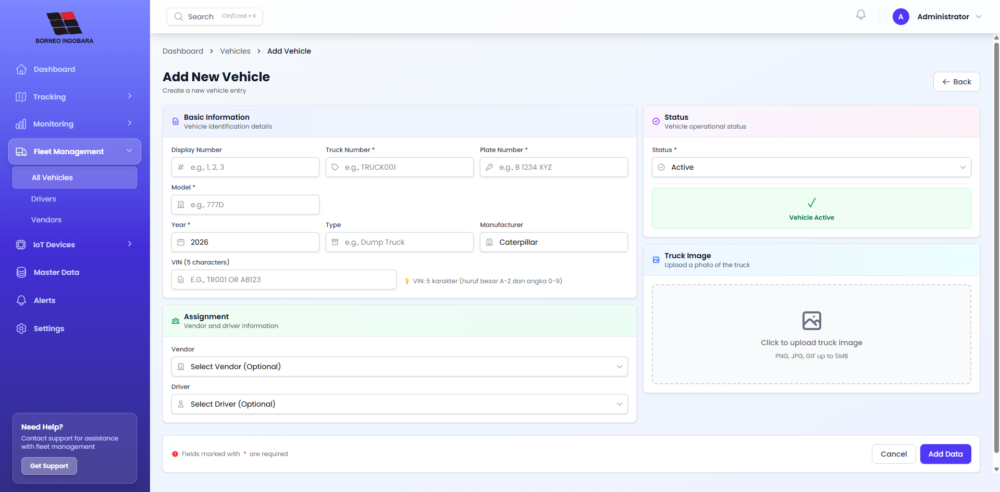
_Form input data kendaraan baru dengan DatePicker dan upload foto_

### 12. Add New Driver

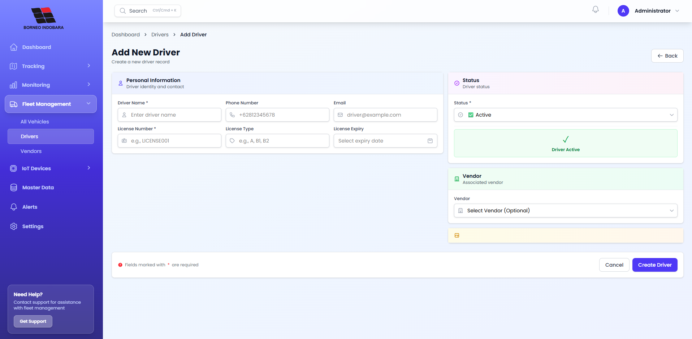
_Form input data pengemudi dengan informasi lisensi dan kontak_

### 13. Add New Sensor

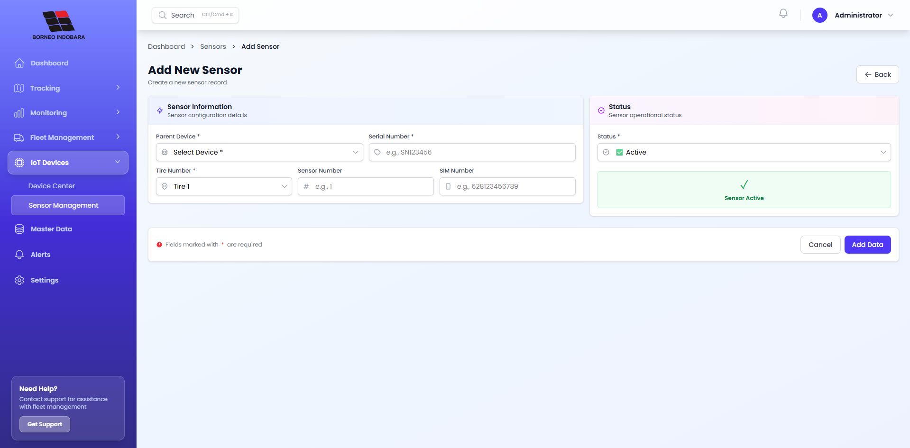
_Form konfigurasi sensor TPMS dengan posisi ban_

### 14. Add New Device

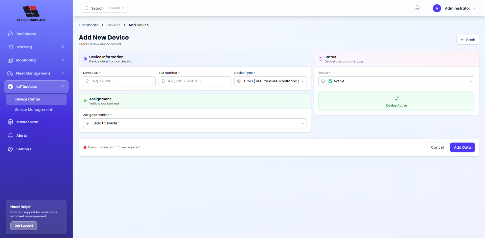
_Form registrasi perangkat IoT/GPS baru_

### 15. Add New Vendor

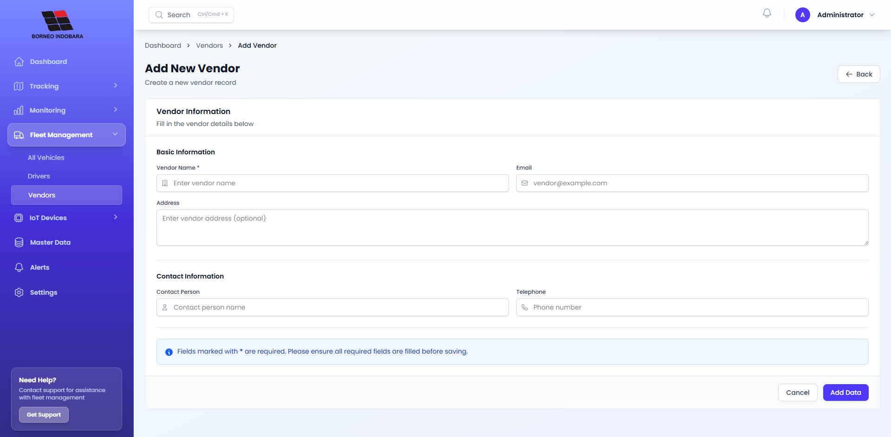
_Form registrasi vendor dan kontraktor baru_


### 16. Settings

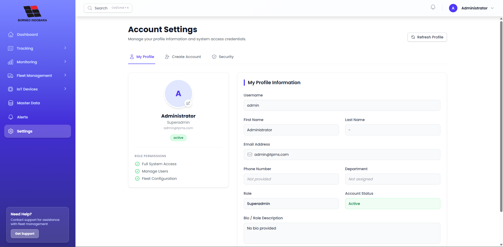
_Halaman pengaturan aplikasi dan profil pengguna_
